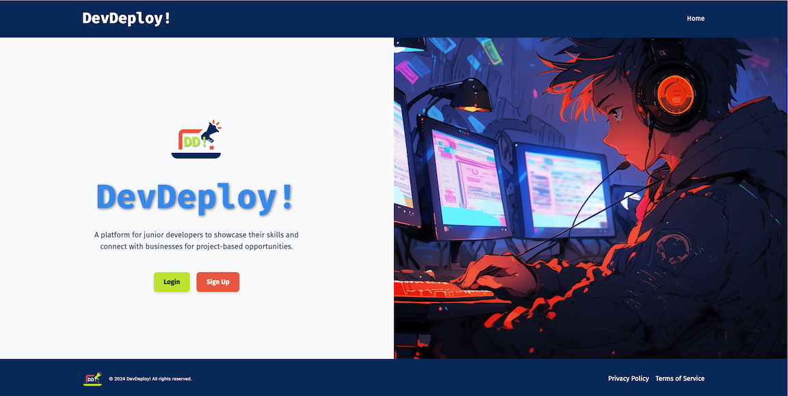

# Project 03 - DevDeploy!


## Project 3 Group 1
[Alvin Estado](https://github.com/alvin-est), [Cameron Beattie](https://github.com/Cbeattie97), [Tinaika Pereira](https://github.com/Tinaika19) & [Kate Stapley](https://github.com/KateHanSta17)

## Github Repo
[DevDeploy! Repo](https://github.com/alvin-est/dev-deploy)

## Render Deploymenet
[DevDeploy! Live](https://dev-deploy-1.onrender.com/)

## Description
DevDeploy! is a social media and networking platform designed to connect potential employers with junior and novice developers. The platform allows users to create profiles, showcase skills, list projects, and interact with potential job opportunities in a supportive environment tailored to new developers.

## Table of Contents
- [Features](#features)
- [Installation](#installation)
- [Usage](#usage)
- [Screenshots](#screenshots)
- [License](#license)
- [Contributors](#contributors)
- [Tests](#tests)
- [Technologies](#technologies)
- [Future Enhancements](#future-enhancements)

## Features
- User profiles showcasing skills, projects, and contact information.
- Skills are color-coded for a visually engaging display.
- Employers can browse junior developers and contact them via profile links.
- Integrated GitHub and resume linking functionality.
- Fully responsive design for mobile and desktop users.
- Authentication system to ensure user security.

## Installation
To run the project locally:
1. Clone the repository:
   ```bash
   git clone <https://github.com/alvin-est/dev-deploy.git>
   ```
2. Navigate to the project directory:
      ``` bash
      cd devdeploy
      ```
3. Install dependencies:
      ``` bash
      npm install
      ```
4. Start the development server:
      ``` bash
      npm run develop
      ```
5. Open your browser at ``` http://localhost:3000 ```.

## Usage
1. Visit the deployed application at [DevDeploy!](https://dev-deploy-1.onrender.com/).
2. Create an account.
3. Add skills, projects, and links to your GitHub or portfolio.
4. Browse other developers and network with potential employers.
5. Edit your profile at any time via the profile settings page.

## License
This project is licensed under the MIT license.

## Screenshots



## Contributors
- [Alvin Estado](https://github.com/alvin-est) Scrum Master & Backend Developer + QA/UAT
- [Cameron Beattie](https://github.com/Cbeattie97) Backend Developer & DevOps + QA/UAT
- [Tinaika Pereira](https://github.com/Tinaika19) Frontend Developer & UI/UX + QA/UAT
- [Kate Stapley](https://github.com/KateHanSta17) Frontend Developer & UI Designer + QA/UAT  


## Tests
To run tests:

1. Ensure you are in the project ``` root ``` directory.
2. Run the following command:
``` bash
npm test
```
3. View the test results in the terminal.

## Technologies
- __Frontend__: React, Tailwind CSS
- __Backend__: Node.js, Express.js
- __Database__: MongoDB, Mongoose
- __State Management__: Apollo Client for GraphQL
- __Hosting__: Render (Backend) and Netlify (Frontend)

---- 


---

## 24 Final Project: MERN Stack Single-Page Application
Projects have played a key role in your journey to becoming a full-stack web developer. As you apply for development jobs, your portfolio is absolutely vital to opening doors to opportunities. Your portfolio showcases high-quality deployed examples of your work, and you can use your finished projects for that very purpose.

This project is a fantastic opportunity to show employers your collaborative skills and coding abilities, especially in the context of a scalable, user-focused MERN app. Remember that employers want to see what you can do, but they also want to see how you work with other developers. The more examples of deployed collaborative work you have in your portfolio, the more likely you are to get an interview and a job.

### Project Requirements
Your group will use everything you’ve learned throughout this course to create a MERN stack single-page application that works with real-world data to solve a real-world challenge, with a focus on data and user demand. This project will provide you with the best opportunity to demonstrate your problem-solving skills, which employers will want to see during interviews. Once again, the user story and acceptance criteria will depend on the project that you create, but your project must fulfill the following requirements:
- Use React for the front end.
- Use GraphQL with a Node.js and Express.js server.
- Use MongoDB and the Mongoose ODM for the database.
- Use queries and mutations for retrieving, adding, updating, and deleting data.
- Be deployed using Render (with data).
- Have a polished UI.
- Be responsive.
- Be interactive (i.e., accept and respond to user input).
- Include authentication (JWT).
- Protect sensitive API key information on the server.
- Have a clean repository that meets quality coding standards (file structure, naming conventions, best practices for class and id naming conventions, indentation, high-quality comments, etc.).
- Have a high-quality README (with unique name, description, technologies used, screenshot, and link to deployed application).

### CSS Styling
Instead of using a CSS library like Bootstrap, consider one of the following suggestions:
- Look into the concept of CSS-in-JS, which abstracts CSS to the component level, using JavaScript to describe styles in a declarative and maintainable way. Some popular libraries include styled-components and Emotion.
- Try using a component library, such as Semantic UI, Chakra UI, or Ant Design.
- Create all the CSS for your application just using CSS.

Ultimately, it doesn't matter which of these options you choose—it just needs to look professional and be mobile-friendly.
